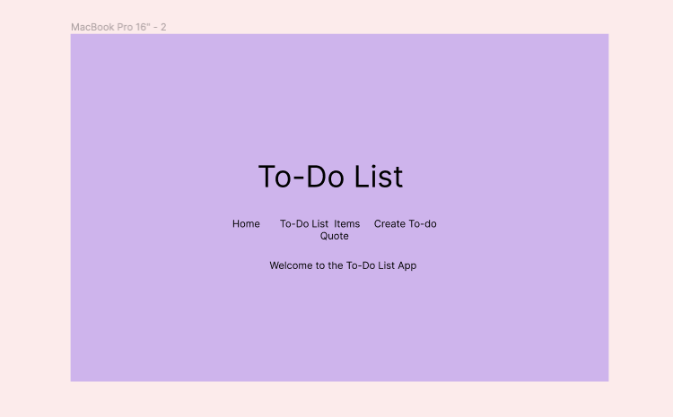
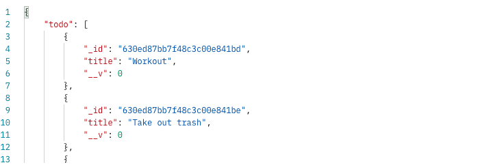
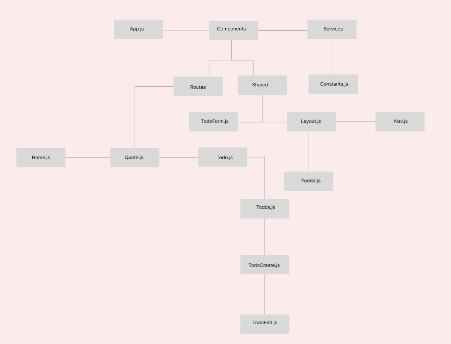

# Get'Er Done App

Here at Get'Er Done we believe in completeing tasks with efficency. Do you have trouble staying organized? Most people do but this to-do list app allows for its users to create, edit and delete tasks at the click of a button! No need to procrastinate, organize your task here and Get'Er Done! Live site [here] (https://630ef20d61ec4f4fbccf4add--geterdone.netlify.app/todos)

## Technologies Used 
- [React.js](https://reactjs.org/)
- [React Router](https://reactrouter.com/)
- [Axios](https://axios-http.com/)
- [Express](https://expressjs.com/) 
- [Mongoose](https://mongoosejs.com/)
- [Node.js](https://nodejs.org/en/)

# WireFrames for Desktop 
## Home 

## Quote Page 

### API Doc
I used the Inspiration API to to pull a motivational quote that can be read by clicking the Quote link. This API uses a cache, which exprires every hour. During this period, quotes will not be updated. This API only provides one endpoint. -[Inspiration API](https://api.goprogram.ai/inspiration/docs/) 

This is an example of how to get a To-Do List
axios.get(`https://tranquil-reaches-95487.herokuapp.com/api/todos`)

## Component Hierarchy 

## MVP
- [X] Full stack app built using MERN
- [X] At least one model with full CRUD 
- [X] Pull from a 3rd party API

## Post MVP 
- [] Dark mode
- [] Mobile Responsive
 

